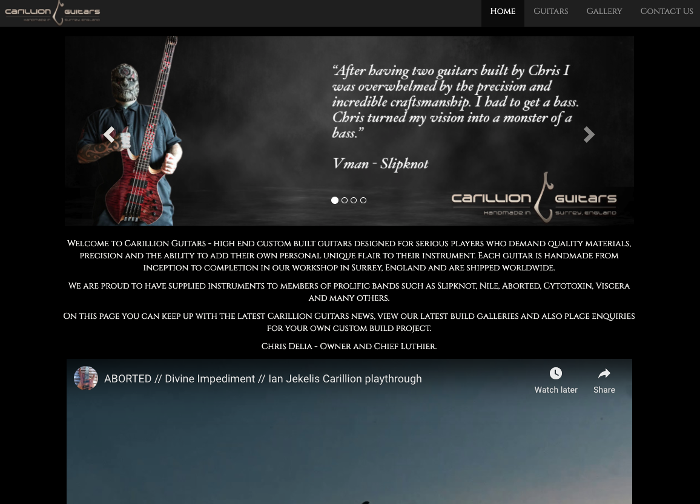

# Carillion Guitars

The purpose of this project was to create a static web-page for a local guitar luthier, Carillion Guitars. 

Carillion Guitars make world-class custom built instruments for the heavy metal market. As the guitars are handbuilt solely by one luthier from scratch the lead-time is extensive but thusly has earned them a prolific reputation. 

## UX

The brand supplies custom made guitars for prestigious artists who tour globally and the web-page is to demonstrate what models are on offer and also the wide variety of finishes and designs that are available. 

Largely important to this site, over a typical guitar manufacturers site is the variations of one product and also the prestiege that comes with owning one of these guitars. 

Therefore I included;

- References to the artists that use these products - instantly visible upon viewing the homepage. 
- An easy reference to the different shapes/designs of guitars
- Video of artist using a unique design
- Gallery showing the quality of recent work by the company
- Social links so potential customers can keep up with latest posts

This section is also where you would share links to any wireframes, mockups, diagrams etc. that you created as part of the design process. These files should themselves either be included as a pdf file in the project itself (in an separate directory), or just hosted elsewhere online and can be in any format that is viewable inside the browser.

## Features

In this section, you should go over the different parts of your project, and describe each in a sentence or so.
 
### Existing Features

#### Homepage

##### Carousel -
The homepage carousel shows quickly the range of artists that are on the artist roster. These names should be instantly recognisable to anyone who has come to the site. 
(Carousel tagline/about - this supports the above carousel and gives a small supportive statement to affirm the quality of the brand)
Included in the images is a quoted review from each artist.  

##### Iframe Video;
The purpose of the video is to engage users and to encourage them to view the use of one of the guitars with a well known artist. 

##### Modals (news);
The last section of the homepage is modals that the user an click on to again support the tight affiliation of the company with the leading players in the target market. In future updates of this project I would probably either remove this section or link directly to a social media post.

##### Guitars

Image cards
I provided images to the types of guitars available at Carillion. Design-wise it was difficult to know what to implement here as there is no standard product to offer as each item is one-of-a-kind and this would be covered in the gallery. In future I would implement a 'cost estimator' style template where the user could pick from different options and it would generate an estimated cost. 

##### Gallery

Fancybox 
I used fancybox here to implement my gallery which allows the user to see thumbnails, click the item to view larger image and also start a slideshow.

Nav's and Footers
All pages have the same navbar fixed to the top of the screen and a footer with links to the social media of the company.

### Features Left to Implement
- Once I become more proficient with new languages and methods there is a lot I would like to do with this project. 

I would like to add a cost-calculator, sound clips of the guitars, a more extensive video section that demonstrates the guitars. 

## Technologies Used

[HTML5]
    Used to build the front end of the website
[CSS] 
    Used to style the website

[Bootstrap 3]
 - (https://bootstrapcdn.com)
    - Used to for the navbars, footers and sections of layouts such as cards and displays of modals

[JQuery]
(https://jquery.com)
    - The project uses **JQuery** to simplify DOM manipulation.

[Javascript]
(https://javascript.com)
    - Used to add some animation to opening of modals. Used with Fancybox. 

[Fancybox]
(https://fancybox.net)
    - Used to add gallery and slideshow

## Testing

I tested the site to check for any navigation errors such as broken links or buttons that failed to open modals. I also tested that the gallery section displayed correctly and had no issues with slideshow or opening larger images from thumbnails. 

### Devices Used

- Macbook Pro 13.5 Retina
- Samsung s10+
- iPhone 8
- Routed desktop via 32in Curved Samsung HD Media Screen 
- Samsung A6 Tablet

### Broswers Used

- Google Chrome
- Mozilla Firefox
- Safari

### Bugs 

I struggled to get a good size for the modal inclusion of a video relating to the right modal. Opening the modal shows a very small version of the video. I was unable to find a solution to showcasing what I wanted in this section - I would in future replace this with perhaps more text and an external link to listen/view media relating to this. 

### Validation

All files passed validation testing at https://validator.w3.org/nu/#textarea 

### Deployment

https://rossmclenny.github.io/carillion/ my page is hosted here. 

I was able to deploy the website here by going to my repository in which all the files are saved, clicking on settings at the top and scrolling down to the heading GitHub Pages. Underneath the heading there is a source and I chose master branch from the dropdown which allows you to host the website on GitHub Pages.

## Credits

### Content and Media

I used quotes from artists marked in the images of the carousel from both direct conversations and also their own social media postings. 

Images were obtained and used with permission from Will Satchwell Photography and also from Chris Delia, owner of Carillion Guitars.

Artwork for carousel was edited by myself with artwork from Aborted, Dyscarnate and Nile with permission and received via email. 

### Acknowledgements

- Code Institute
- w3Schools - for the navbar layout, modals and footer
- Bootstrap - for the carousel 
- Traversy Media - Brad Travers - for inspiration and content relating to modal displays
- Fancybox - for the gallery layout 

